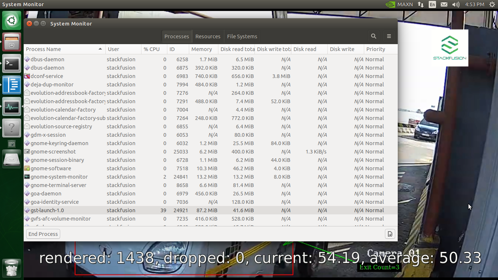
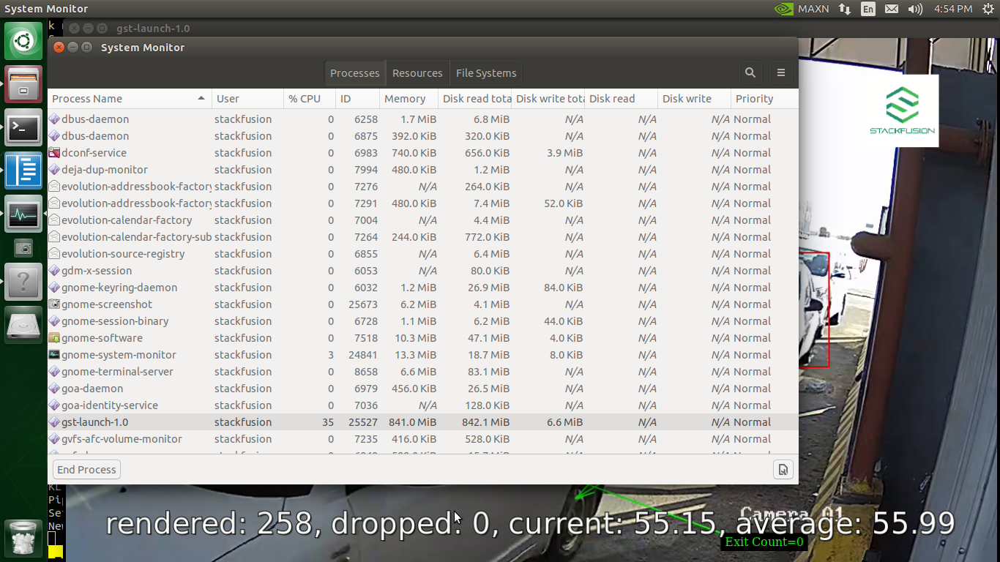

# Description

This plugin is performs object detetion using edgetpu on jetson nano.

--------------------------------------------------------------------------------
## Pre-requisites
- GStreamer-1.0 Development package
- GStreamer-1.0 Base Plugins Development package
- OpenCV Development package
- Jetpack 4.4
- Deepstream 5.0

# Installation
1. Clone the Git Repository directory
2. Run

    ```sudo make install```

3. Verify Installation

    ``` gst-inspect-1.0 dscoralinfer ```

    Expect output

```
        Factory Details:
        Rank                     primary (256)
        Long-name                Coral Infer plugin for NVIDIA Deepstream
        Klass                    Coral Infer plugin for NVIDIA Deepstream
        Description              Perform inference on Google coral usb accelerator
        Author                   Stackfusion PVT LTD (https://www.parkzap.com)

        Plugin Details:
        Name                     nvdsgst_dscoralinfer
        Description              Inference plugin for google coral for NVIDIA Deepstream
        Filename                 /usr/lib/aarch64-linux-gnu/gstreamer-1.0/deepstream/libnvdsgst_dscoralinfer.so
        Version                  5.0.0
        License                  Proprietary
        Source module            dscoralinfer
        Binary package           Inference plugin for google coral for NVIDIA Deepstream
        Origin URL               https://parkzap.com/

        GObject
        +----GInitiallyUnowned
            +----GstObject
                    +----GstElement
                        +----GstBaseTransform
                                +----GstCoralInfer

        Pad Templates:
        SRC template: 'src'
            Availability: Always
            Capabilities:
            video/x-raw(memory:NVMM)
                        format: { (string)NV12, (string)RGBA, (string)I420 }
                        width: [ 1, 2147483647 ]
                        height: [ 1, 2147483647 ]
                    framerate: [ 0/1, 2147483647/1 ]

        SINK template: 'sink'
            Availability: Always
            Capabilities:
            video/x-raw(memory:NVMM)
                        format: { (string)NV12, (string)RGBA, (string)I420 }
                        width: [ 1, 2147483647 ]
                        height: [ 1, 2147483647 ]
                    framerate: [ 0/1, 2147483647/1 ]

        Element has no clocking capabilities.
        Element has no URI handling capabilities.

        Pads:
        SINK: 'sink'
            Pad Template: 'sink'
        SRC: 'src'
            Pad Template: 'src'

        Element Properties:
        name                : The name of the object
                                flags: readable, writable
                                String. Default: "coralinfer0"
        parent              : The parent of the object
                                flags: readable, writable
                                Object of type "GstObject"
        qos                 : Handle Quality-of-Service events
                                flags: readable, writable
                                Boolean. Default: false
        unique-id           : Unique ID for the element. Can be used to identify output of the element
                                flags: readable, writable
                                Unsigned Integer. Range: 0 - 4294967295 Default: 15
        processing-width    : Width of the input buffer to algorithm
                                flags: readable, writable
                                Integer. Range: 1 - 2147483647 Default: 300
        processing-height   : Height of the input buffer to algorithm
                                flags: readable, writable
                                Integer. Range: 1 - 2147483647 Default: 300
        full-frame          : Enable to process full frame or disable to process objects detectedby primary detector
                                flags: readable, writable
                                Boolean. Default: true
        gpu-id              : Set GPU Device ID
                                flags: readable, writable, changeable only in NULL or READY state
                                Unsigned Integer. Range: 0 - 4294967295 Default: 0
        model-path          : path of model used by edge-tpu
                                flags: readable, writable
                                String. Default: null
        label-path          : path of label used by edge-tpu
                                flags: readable, writable
                                String. Default: null
        threshold           : threshold of object to be detected by edge-tpu
                                flags: readable, writable
                                Float. Range:               0 -               1 Default:             0.7
        config-file-path    : Absolute pathname of configuration file for the coralinfer element
                                flags: readable, writable
                                String. Default: null
        detected-max-h      : Default max height of detected class
                                flags: readable, writable
                                Integer. Range: 1 - 2147483647 Default: 0
        detected-max-w      : Default max width of detected class
                                flags: readable, writable
                                Integer. Range: 1 - 2147483647 Default: 0
        detected-min-h      : Default min height of detected class
                                flags: readable, writable
                                Integer. Range: 1 - 2147483647 Default: 0
        detected-min-w      : Default min width of detected class
                                flags: readable, writable
                                Integer. Range: 1 - 2147483647 Default: 0
        enable              : enable class by defaultby primary detector
                                flags: readable, writable
                                Boolean. Default: false
        eps                 : eps values for overlapping, to be used by cv::groupRectangles edge-tpu
                                flags: readable, writable
                                Double. Range:               0 -   1.797693e+308 Default:               0
        group-threshold     : Min number of rectangle to consider a cluster to be used by cv::groupRectangles
                                flags: readable, writable
                                Integer. Range: 1 - 2147483647 Default: 0
```

--------------------------------------------------------------------------------
# Usage
    gst-launch-1.0 uridecodebin uri=file://<video_path> ! m.sink_0 nvstreammux name=m batch-size=1 width=1280 height=720 ! dscoralinfer config-file-path="<config_file_path>" ! nvvideoconvert ! nvtracker tracker-width=640 tracker-height=320 ll-lib-file=/opt/nvidia/deepstream/deepstream-5.0/lib/libnvds_mot_klt.so ll-config-file=<tracker_config_path> ! nvdsosd ! nvvideoconvert ! fpsdisplaysink name=fpssink text-overlay=true video-sink=xvimagesink sync=0

### Example:

    gst-launch-1.0 uridecodebin uri=file:///home/stackfusion/pipline/sample_short.mp4 ! m.sink_0 nvstreammux name=m batch-size=1 width=1280 height=720 ! dscoralinfer config-file-path=resource/sample_config.txt ! nvvideoconvert ! nvtracker tracker-width=640 tracker-height=320 ll-lib-file=/opt/nvidia/deepstream/deepstream-5.0/lib/libnvds_mot_klt.so ll-config-file=/resource/tracker_config_1.yml ! nvdsosd ! nvvideoconvert ! fpsdisplaysink name=fpssink text-overlay=true video-sink=xvimagesink sync=0

# Running a Benchmark

    gst-launch-1.0 uridecodebin uri=file:///home/stackfusion/pipline/sample_short.mp4 ! m.sink_0 nvstreammux name=m batch-size=1 width=1280 height=720 ! dscoralinfer config-file-path="resource/sample_config.txt" ! nvvideoconvert ! nvtracker tracker-width=640 tracker-height=320 ll-lib-file=/opt/nvidia/deepstream/deepstream-5.0/lib/libnvds_mot_klt.so ll-config-file=resource/tracker_config_1.yml ! nvdsosd ! nvvideoconvert ! fpsdisplaysink name=fpssink text-overlay=true video-sink=xvimagesink sync=0

### Results

**Device** : Jetson Nano (Developer kit version)

**Jetpack** : 4.4DP

**Deepstream** : 5.0

**Model** : SSD Movilenet v2

|            |        |
|------------|--------|
| Frame rate | 54 fps |
| Ram Usage  | 71Mb |
| Cpu Usage  |  30% |

--------------------------------------------------------------------------------
# Properties:

    name                : The name of the object
                            flags: readable, writable
                            String. Default: "coralinfer0"
    parent              : The parent of the object
                            flags: readable, writable
                            Object of type "GstObject"
    qos                 : Handle Quality-of-Service events
                            flags: readable, writable
                            Boolean. Default: false
    unique-id           : Unique ID for the element. Can be used to identify output of the element
                            flags: readable, writable
                            Unsigned Integer. Range: 0 - 4294967295 Default: 15
    processing-width    : Width of the input buffer to algorithm
                            flags: readable, writable
                            Integer. Range: 1 - 2147483647 Default: 300
    processing-height   : Height of the input buffer to algorithm
                            flags: readable, writable
                            Integer. Range: 1 - 2147483647 Default: 300
    full-frame          : Enable to process full frame or disable to process objects detectedby primary detector
                            flags: readable, writable
                            Boolean. Default: true
    gpu-id              : Set GPU Device ID
                            flags: readable, writable, changeable only in NULL or READY state
                            Unsigned Integer. Range: 0 - 4294967295 Default: 0
    model-path          : path of model used by edge-tpu
                            flags: readable, writable
                            String. Default: null
    label-path          : path of label used by edge-tpu
                            flags: readable, writable
                            String. Default: null
    threshold           : threshold of object to be detected by edge-tpu
                            flags: readable, writable
                            Float. Range:               0 -               1 Default:             0.7
    config-file-path    : Absolute pathname of configuration file for the coralinfer element
                            flags: readable, writable
                            String. Default: null
    detected-max-h      : Default max height of detected class
                            flags: readable, writable
                            Integer. Range: 1 - 2147483647 Default: 0
    detected-max-w      : Default max width of detected class
                            flags: readable, writable
                            Integer. Range: 1 - 2147483647 Default: 0
    detected-min-h      : Default min height of detected class
                            flags: readable, writable
                            Integer. Range: 1 - 2147483647 Default: 0
    detected-min-w      : Default min width of detected class
                            flags: readable, writable
                            Integer. Range: 1 - 2147483647 Default: 0
    enable              : enable class by defaultby primary detector
                            flags: readable, writable
                            Boolean. Default: false
    eps                 : eps values for overlapping, to be used by cv::groupRectangles edge-tpu
                            flags: readable, writable
                            Double. Range: 0 -   1.797693e+308 Default:  0
    group-threshold     : Min number of rectangle to consider a cluster to be used by cv::groupRectangles
                            flags: readable, writable
                            Integer. Range: 1 - 2147483647 Default: 0

--------------------------------------------------------------------------------

# Sample

## Vehicle counting sample pipeline

#### With Coral USB Accelerator

    gst-launch-1.0 uridecodebin uri=file:///home/stackfusion/pipline/sample_short.mp4 ! m.sink_0 nvstreammux name=m batch-size=1 width=1280 height=720 ! dscoralinfer config-file-path="resource/sample_config.txt" ! nvvideoconvert ! nvtracker tracker-width=640 tracker-height=320 ll-lib-file=/opt/nvidia/deepstream/deepstream-5.0/lib/libnvds_mot_klt.so ll-config-file=resource/tracker_config_1.yml ! nvdsosd ! nvvideoconvert ! fpsdisplaysink name=fpssink text-overlay=true video-sink=xvimagesink sync=0

#### Without Coral USB Accelerator
    gst-launch-1.0 filesrc location=/home/stackfusion/pipline/ds-edgetpu-infer/sample_short.mp4 ! qtdemux ! h264parse ! nvv4l2decoder ! m.sink_0 nvstreammux name=m batch-size=1 width=1280 height=720 ! nvinfer config-file-path= /opt/nvidia/deepstream/deepstream-5.0/samples/configs/deepstream-app/config_infer_primary_nano.txt batch-size=1 unique-id=1 ! nvvideoconvert ! nvtracker tracker-width=640 tracker-height=320 ll-lib-file=/opt/nvidia/deepstream/deepstream-5.0/lib/libnvds_mot_klt.so ll-config-file=resource/tracker_config_1.yml ! nvdsanalytics config-file=resource/config_nvdsanalytics.txt ! nvdsosd ! nvvideoconvert ! fpsdisplaysink name=fpssink text-overlay=true video-sink=xvimagesink sync=0

#### Memory Usage with Coral Plugin



##### Vehicle Counting and Classification using Edge AI device in realtime with Coral TPU + Jetson Nano
[](https://www.youtube.com/watch?v=q2l1ImkkSLY)

#### Memory Usage without Coral Plugin


#### Vehicle Counting and Classification using Edge AI device in realtime
[](https://www.youtube.com/watch?v=MHJCetQDi8s)
